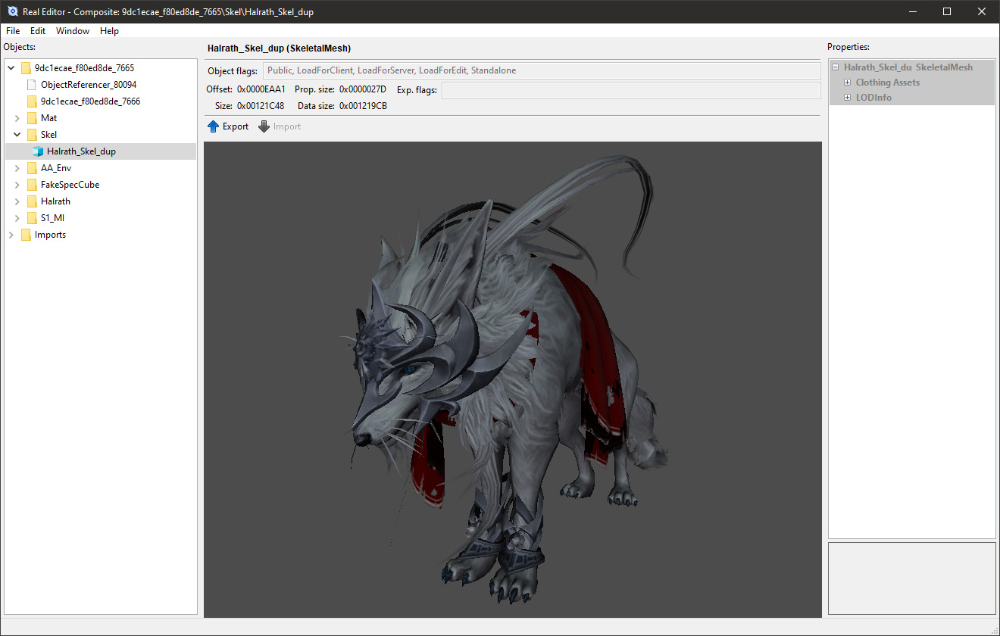

## Real Editor
> Tera Online 64-bit client package(\*.gpk, \*.gmp, \*.upk, \*.umap, \*.u) editor/viewer. 32-bit version is [here](https://github.com/VenoMKO/Real-Editor) and it's no longer supported.

Currently under development. Some features are not implemented yet or may not work correctly.

### Wiki

* [Installation and manual](https://github.com/VenoMKO/RealEditor/wiki/Installation-and-manual)
* [64 bit modding. How does it work?](https://github.com/VenoMKO/RealEditor/wiki/64-bit-modding.-How-does-it-work%3F)
* [Create a mod](https://github.com/VenoMKO/RealEditor/wiki/Create-a-mod)
* [Create a composite mod](https://github.com/VenoMKO/RealEditor/wiki/Create-a-composite-mod)
* [Export a 3D model](https://github.com/VenoMKO/RealEditor/wiki/Export-a-3D-model)
* [Troubleshooting](https://github.com/VenoMKO/RealEditor/wiki/Troubleshooting)
* [Smartscreen and Antiviruses](https://github.com/VenoMKO/RealEditor/wiki/Smartscreen-and-Antiviruses)
* [Automatic composite mod installation via TMM](https://github.com/VenoMKO/TMM#tmm-tera-mod-manager)

### Wiki на русском

* [Wiki](https://github.com/VenoMKO/RealEditor/wiki/Wiki-%D0%BD%D0%B0-%D1%80%D1%83%D1%81%D1%81%D0%BA%D0%BE%D0%BC)

### System requirements
* Windows 10 x64 (RE can run on previous Windows versions, but some features may not work)

### Download

You can get the latest version in the ['Releases' section](https://github.com/VenoMKO/RealEditor/releases).

### Features

* Opening/Saving 64-bit packages
* Textures export/import to *.png, *.tga, *.dds
* 3D model export to *.fbx
* Sound export to *.ogg
* Properties viewer
* DXT texture viewer
* 3D model viewer
* Bulk composite extraction and modding
* Dumping table of contents of composite packages
* Combining composite mods to a single mod file
* Remove region locking from packages
* Encrypt/Decrypt mappers

### Plans

* Mesh import from *.fbx
* Materials support
* Map renderer
* Map export to UE4 via *.t3d or custom Datasmith plugin
* Animation renderer / exporter to *.fbx
* HiDPI screen support

### Contacts

* [Tumblr](https://yupimods.tumblr.com/)
* Discord Yupi#9153
