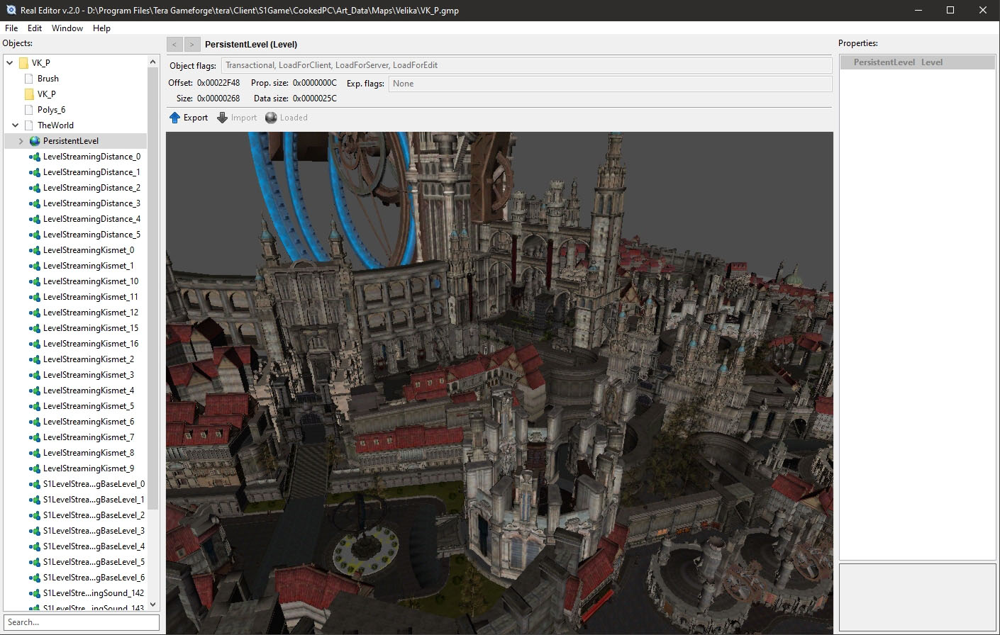

## Real Editor
> Tera Online 64-bit client package(\*.gpk, \*.gmp, \*.upk, \*.umap, \*.u) editor/viewer. 32-bit version is [here](https://github.com/VenoMKO/Real-Editor) and it's no longer supported.

Currently under development. Some features are not implemented yet or may not work correctly.

### Features

| Type | Export | Import | Format | Classes |
| --- | --- | --- | --- | --- |
| **Textures** | :heavy_check_mark: | :heavy_check_mark: | TGA, PNG, DDS | Texture2D, TextureFlipBook, ShadowMap2D, LightMap |
| **Sounds** | :heavy_check_mark: | :heavy_check_mark: | OGG | SoundNodeWave |
| **3D models** | :heavy_check_mark: | :x: | FBX | StaticMesh |
| **3D models** | :heavy_check_mark: | :heavy_check_mark: | FBX | SkeletalMesh |
| **Speed Trees** | :heavy_check_mark: | :x: | SPT | SpeedTree |
| **Maps, Dungeons** | :heavy_check_mark: | :x: | Unreal 4.26 | Level, StreamingLevel, S1StreamingLevel |
| **SWF/GFX** | :heavy_check_mark: | :heavy_check_mark: | Binary | GFxMovieInfo, SwfMovie |
| **DataCenter** | :heavy_check_mark: | :x: | XML/JSON | DataCenter_Final.dat |

* Material graph viewer
* Bulk composite extraction and modding
* Combining composite mods to a single mod file
* Cross-region mods
* Encrypt/Decrypt mappers

### Plans

* Animation renderer / exporter to *.fbx
* 32-bit Tera support (maybe)

### Wiki

* [Installation and manual](https://github.com/VenoMKO/RealEditor/wiki/Installation-and-manual)

***

* [Create a mod(textures)](https://github.com/VenoMKO/RealEditor/wiki/Create-a-mod)
* [Create a composite mod(textures)](https://github.com/VenoMKO/RealEditor/wiki/Create-a-composite-mod)
* [Create a 3D model mod](https://github.com/VenoMKO/RealEditor/wiki/Edit-3D-models)
* [Create a sound mod](https://github.com/VenoMKO/RealEditor/wiki/Export-and-Import-music-and-sounds)

***

* [Costume GPK files[EN]](https://github.com/VenoMKO/RealEditor/wiki/Costumes-and-their-GPK-files-%5BEN%5D)
* [Accessory GPK files[EN]](https://github.com/VenoMKO/RealEditor/wiki/Accessories-and-their-GPK-files-%5BEN%5D)

***

* [Export a 3D model](https://github.com/VenoMKO/RealEditor/wiki/Export-a-3D-model)
* [Export DataCenter.dat](https://github.com/VenoMKO/RealEditor/wiki/Export-DataCenter.dat-as-XML-or-JSON)
* [Export Levels, Maps, Dungeons to Unreal Engine 4](https://github.com/VenoMKO/RealEditor/wiki/Export-Levels,-Maps,-Dungeons-to-Unreal-Engine-4)
* [Export/Import sounds and music](https://github.com/VenoMKO/RealEditor/wiki/Export-and-Import-music-and-sounds)
* [Export SpeedTrees](https://github.com/VenoMKO/RealEditor/wiki/Export-trees-foliage(SpeedTree)-3D-models)

***

* [Troubleshooting](https://github.com/VenoMKO/RealEditor/wiki/Troubleshooting)
* [Smartscreen and Antiviruses](https://github.com/VenoMKO/RealEditor/wiki/Smartscreen-and-Antiviruses)
* [Automatic composite mod installation via TMM](https://github.com/VenoMKO/TMM#tmm-tera-mod-manager)

***

### System requirements

* Windows 10 x64 (RE can run on previous Windows versions, but some features may not work)
* CPU with AVX2 instructions (Intel Haswell / AMD Excavator or newer)

### Download

You can get the latest version in the ['Releases' section](https://github.com/VenoMKO/RealEditor/releases).

### Contacts

* [Tumblr](https://yupimods.tumblr.com/)
* Discord Yupi#9153
